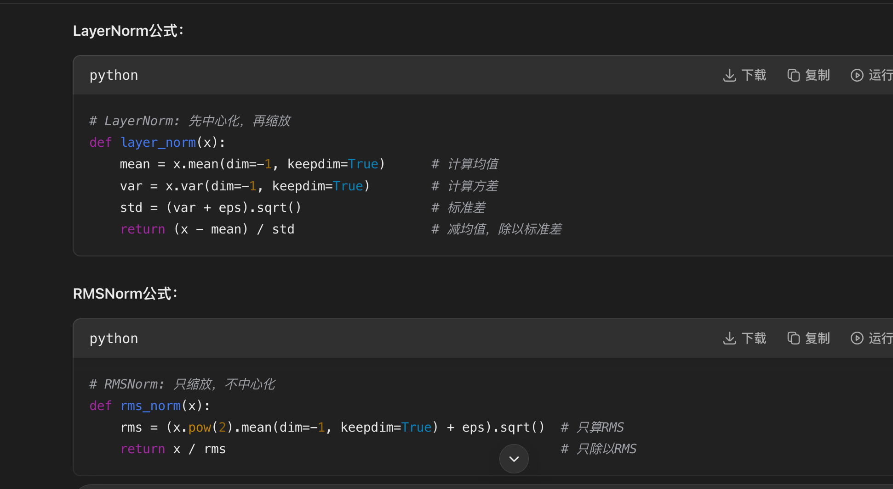

问：qwen123之间的架构变化是什么

Qwen1

* Dense Transformer baseline
* RoPE
* RMSNorm + SwiGLU
* QKV bias
* Untied embedding

Qwen2

* Dense Transformer优化版
* GQA attention
* RoPE scaling（YARN等）
* tokenizer升级
* 工程优化（KV cache等）

👉 仍然Dense，不是MoE主线。

Qwen2.5

* alignment强化
* control tokens扩展
* tool / agent能力增强

Qwen3

* 部分MoE模型出现
* QK-Norm attention
* 去QKV bias
* reasoning强化训练

1就是normal llm base on gpt/llama这种

2的话，词表变大了，分词也更倾向于中文场景，rope的外推性变强了（YARN），从1的8k变成了更大；架构方面，用了group query attention

3的话去掉了qkv bias、qk-norm、moe

问：RMSNorm和layerNorm的区别

RMSNorm计算相对于layerNorm更简单，两者之间的效果区别不是很大

LayerNorm是"先中心化再缩放"，RMSNorm是"只缩放不中心化"。，layer还需要计算均值，减去均值，rms不需要

不管是在训练的时候，梯度反向传播，以及在推理的时候，RMs都会更快
