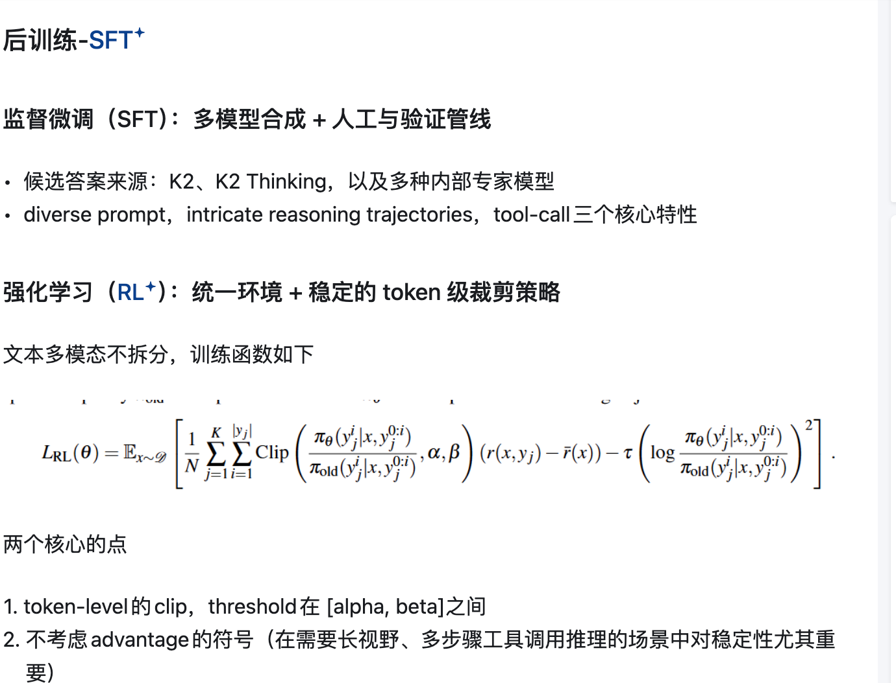

今天是放假的第三天，好久没看一些新技术了

最近出了好多模型：kimi k2.5，glm 5.0，minimax m2.5，openclaw agent，seeddance 2.0

一一了解一下：

#### **kimi k2.5****

总结：kimi2.5本质上在做text和image的统一tool use

Kimi K2.5 的预训练消耗了约 15T 的 Token，分为三个精心设计的阶段：

* **ViT 训练阶段（1T Token）**：
  * 第一段：只优化 **caption 生成的交叉熵损失**，把 MoonViT-3D 对齐到一个 16B 级别的语言模型（文中是 Moonlight-16B-A3B），消耗约 **1T token**，此时主要更新 ViT 权重
  * 第二段：很短，只更新 **MLP projector**，目的是让视觉输出更平滑地接入万亿级 LLM，方便后续联合预训练
* **联合预训练阶段（15T Token）**：
  * 从接近训练末期的 K2 checkpoint 接着训
  * 混合视觉和文本数据继续训练。特别增加了代码相关数据的权重。对每个数据源设置最大 epoch，避免某些源被反复过拟合
* **mid-training**：
  * 训练数据更偏高质量与长样本：长文本、长视频, 推理数据、长链路 CoT
  * 用**YaRN 插值**逐步把长度从**32768 拉到 262144**

这个rl function看不懂

cited from：https://zhuanlan.zhihu.com/p/2000719027690030326
