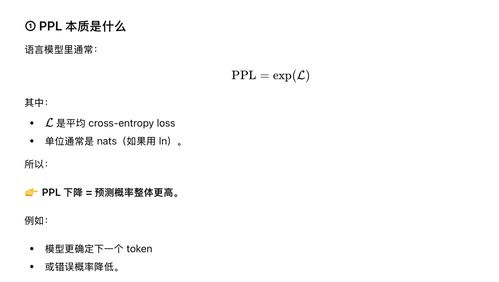

今天qwen3.5发布，本次开源的是MoE模型Qwen3.5-Plus，397B-A17B，总参数397B，激活参数17B，共1个共享专家+512个路由专家，每次10个激活路由专家，上下文也扩展到了1M。同时将词表从150k扩展到250K，支持语言（方言）扩展到201种。

提高的点在于：

1、SDPA后加了门控机制后，整体大模型的PPL降低了2（相当于错误率下降了0.2）--基于NeurIPS 最佳论文的理论基础来做的。

2、文本数据和图像数据混合训练。

3、linear attention（这是啥）。

4、moe框架 397B只A17B

5、mulit-token prediction，提高了吞吐率，如下所示，相当于提升了19倍

