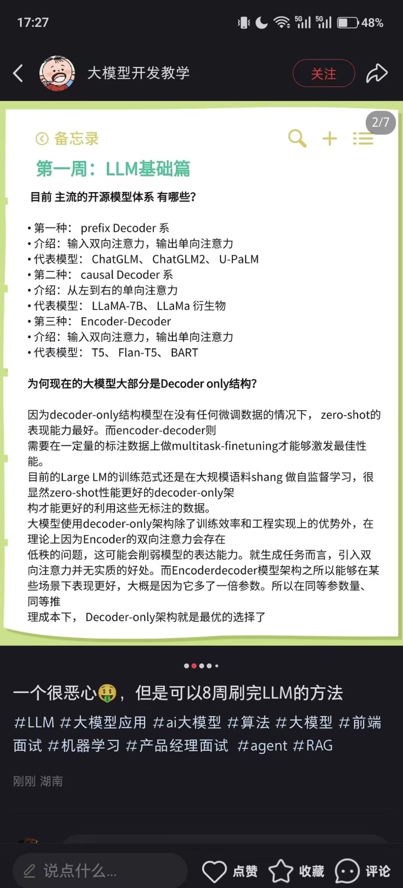

#### openclaw到底是什么东西

核心架构和原理其实非常简单，概括如下：

1. **接入层**：启动一个 [WebSocket 服务](https://zhida.zhihu.com/search?content_id=270541420&content_type=Article&match_order=1&q=WebSocket+%E6%9C%8D%E5%8A%A1&zhida_source=entity)，作为网关接收来自 WhatsApp、飞书等各个渠道的消息。
2. **核心循环**：用户在客户端发起消息后，系统进入 Agent 核心循环（基于 **[pi-agent-core](https://link.zhihu.com/?target=https%3A//github.com/badlogic/pi-mono/blob/main/packages/agent)**）。这一步会进行记忆检索、安全检测，进而调用核心工具（Tools）或技能（[SKILLs](https://zhida.zhihu.com/search?content_id=270541420&content_type=Article&match_order=1&q=SKILLs&zhida_source=entity)）来执行任务，最后将结果写入消息队列。
3. **响应和存储**：将执行结果返回给客户端，并存储聊天记录。
   综合来看就是先进入父agent再分发到子agent，prompt长度减少了，但是调用次数变多了，太工程了，看知乎上说文档也不是很好读，毕竟10w行代码，就不细看了，不过可以接入自己的IM，下次接入自己的telegram去看看

1、目前主流的开源模型架构有哪些（问题太老了）
